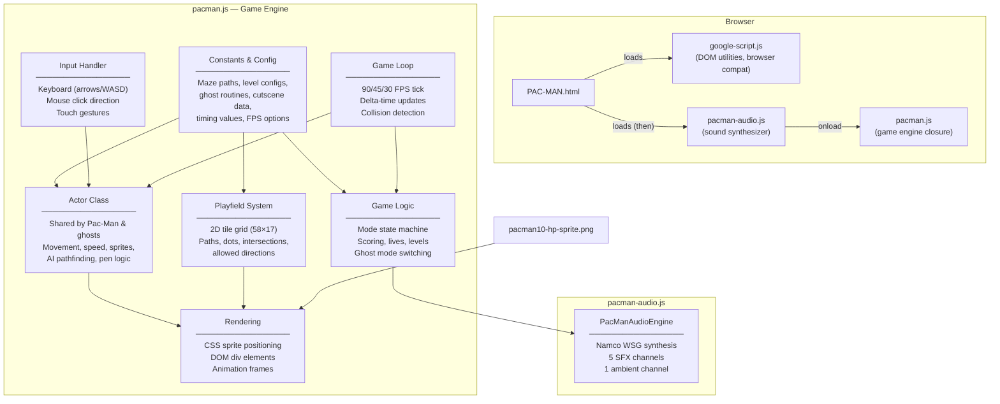
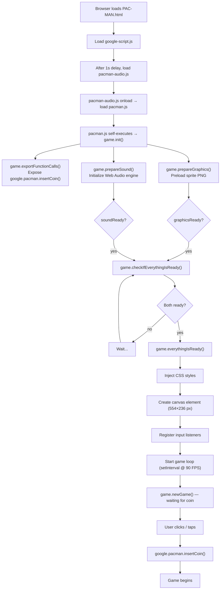
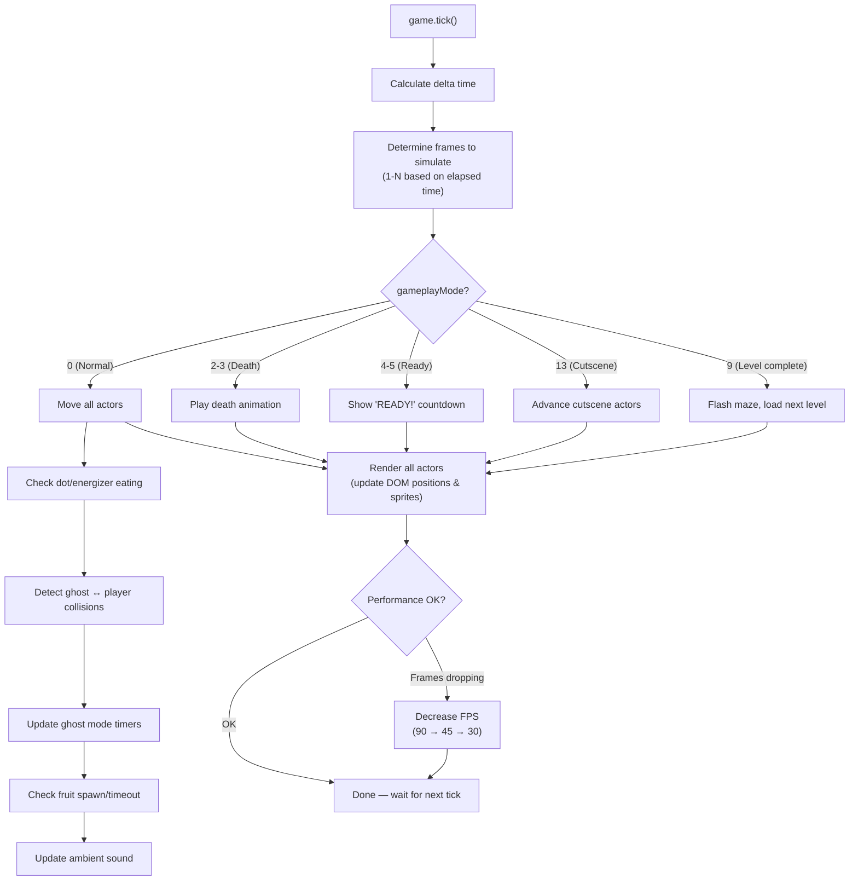
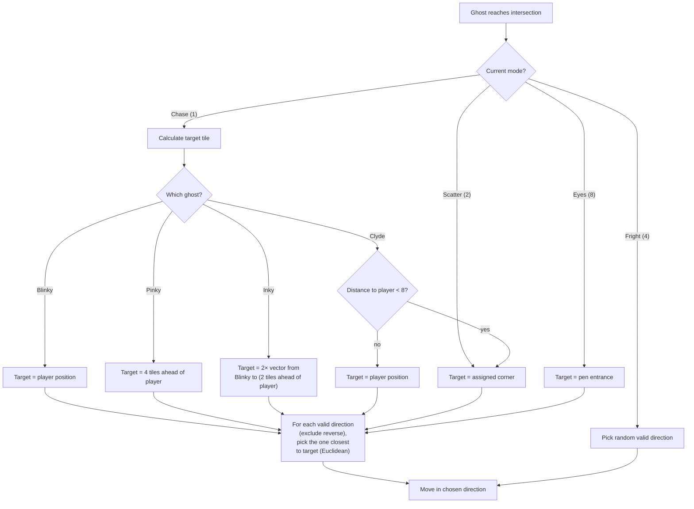
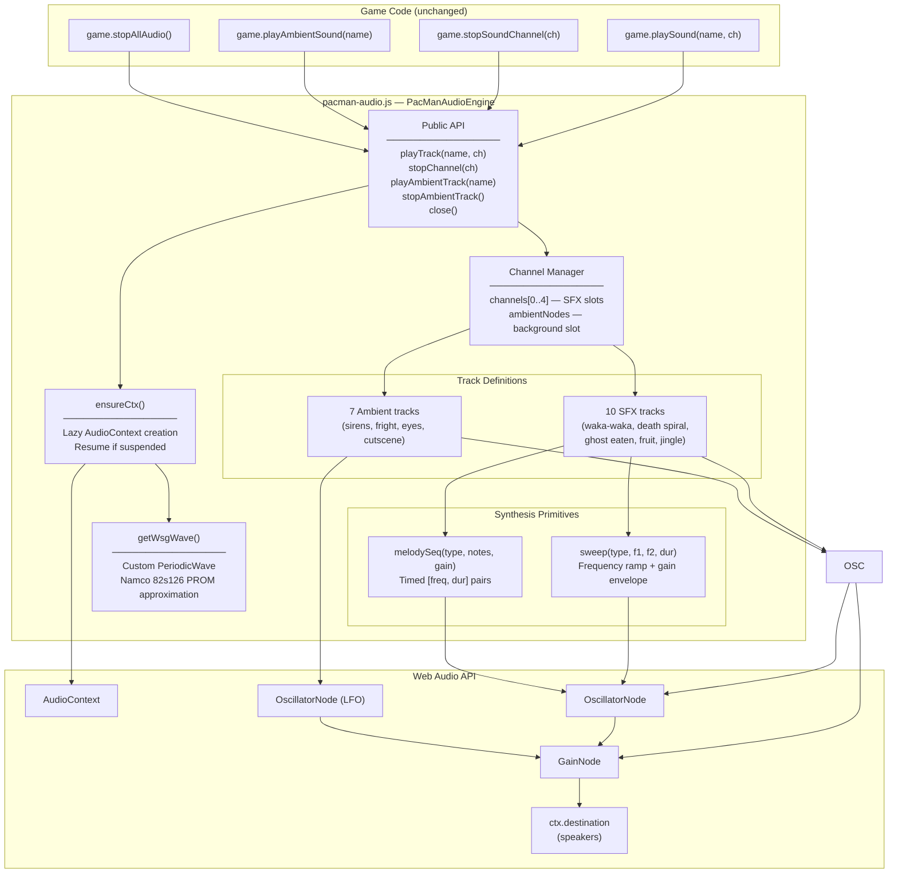
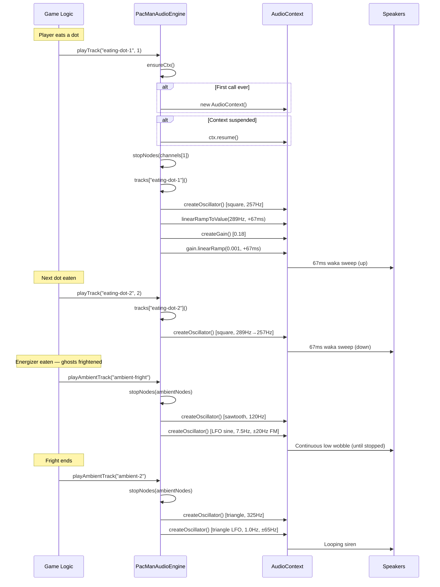

# Google PAC-MAN

A faithful recreation of Google's homepage doodle celebrating the 30th birthday of PAC-MAN, originally published on 22nd May 2010. The source code has been formatted for readability and the defunct Flash-based audio system has been replaced with a modern Web Audio API synthesizer.

> **Source Code** (c) Copyright 2010 Google
> **PAC-MAN**(TM) (c) 1980 NAMCO BANDAI Games Inc.

---

## Table of Contents

- [Original Implementation](#original-implementation)
  - [Project Structure](#project-structure)
  - [Architecture Overview](#architecture-overview)
  - [System Diagram](#system-diagram)
  - [Game Initialization Flow](#game-initialization-flow)
  - [Game Loop](#game-loop)
  - [Actor System](#actor-system)
  - [Ghost AI](#ghost-ai)
  - [Playfield & Rendering](#playfield--rendering)
  - [Input Handling](#input-handling)
  - [Scoring & Progression](#scoring--progression)
- [Enhancements](#enhancements)
  - [Web Audio API Sound Engine](#web-audio-api-sound-engine)
  - [Audio System Architecture](#audio-system-architecture)
  - [Sound Synthesis Flow](#sound-synthesis-flow)
  - [Track Reference](#track-reference)
  - [What Was Removed](#what-was-removed)

---

## Original Implementation

### Project Structure

```
google-pacman/
├── PAC-MAN.html              # Entry point — loads scripts and displays the game
├── pacman.js                  # Core game engine (~3,000 lines)
├── pacman-audio.js            # Web Audio API sound synthesizer (~370 lines)
├── google-script.js           # Google's browser utility/compatibility library
├── pacman10-hp-sprite.png     # Primary sprite sheet (actors, maze, UI)
├── pacman10-hp-sprite-2.png   # Additional sprite resource
├── pacman10-hp.png            # Logo/banner sprite
├── nav_logo13.png             # Google nav logo asset
├── Original/                  # Backup of the unmodified original files
│   └── pacman10-hp-sound.swf  # Original Flash audio (archived)
└── README.md
```

### Architecture Overview

The entire game lives inside a single self-executing closure in `pacman.js`. There is no framework — it uses raw DOM manipulation with CSS sprite sheets for rendering, a `setInterval`-based game loop, and a data-driven design where level configs, ghost routines, and cutscenes are all defined as plain arrays and objects.

### System Diagram



### Game Initialization Flow



### Game Loop

The main loop runs via `setInterval` at a target of 90 FPS. Each tick:



### Actor System

Both Pac-Man and the four ghosts share a single `Actor` class. The constructor takes an ID:

| ID | Entity | Notes |
|----|--------|-------|
| `0` | Pac-Man (Player 1) | Controlled by arrows / mouse / touch |
| `1` | Pac-Man (Player 2) | Controlled by WASD (2-player mode only) |
| `2` | Blinky (Red) | Directly chases player |
| `3` | Pinky (Pink) | Targets 4 tiles ahead of player |
| `4` | Inky (Cyan) | Uses vector from Blinky to player |
| `5` | Clyde (Orange) | Scatters when close to player |

Each actor holds:
- **Position** — pixel `pos[y,x]` and tile `tilePos[y,x]` (8px grid)
- **Direction** — bitmask: `1`=up, `2`=down, `4`=left, `8`=right
- **Mode** — state flags (chase, scatter, fright, eyes, in-pen, exiting-pen, etc.)
- **Speed** — interpolation table derived from a float (e.g. 0.8 = 80% of base speed)

### Ghost AI



Ghosts alternate between **chase** and **scatter** modes on a timer defined per level. When Pac-Man eats an energizer, all ghosts enter **fright** mode for a configurable duration. Eaten ghosts switch to **eyes** mode and navigate back to the pen.

### Playfield & Rendering

The maze is a 58×17 tile grid where each tile is 8×8 pixels. The playfield is defined by `PATH_SEGMENTS` — an array of ~40 rectangles marking walkable corridors. At startup:

1. **`preparePlayfield()`** — allocates the 2D grid
2. **`preparePaths()`** — marks path tiles and places 242 dots + 5 energizers
3. **`prepareAllowedDirections()`** — computes valid turn directions at each intersection
4. **`createPlayfieldElements()`** — creates a DOM `<div>` for each dot

Rendering is entirely CSS-based: each actor and dot is a positioned `<div>` with a background-image offset into the sprite sheet. No `<canvas>` element is used — sprite frames are selected by changing `background-position`.

### Input Handling

Three input methods are supported simultaneously:

| Method | Mapping |
|--------|---------|
| **Keyboard** | Arrow keys → Player 1; WASD → Player 2 |
| **Mouse** | Click position relative to Pac-Man → cardinal direction |
| **Touch** | Tap = click-style; Swipe = gesture direction |

Input sets `requestedDir` on the actor, which is consumed on the next tile boundary.

### Scoring & Progression

| Item | Points |
|------|--------|
| Dot | 10 |
| Energizer | 50 |
| 1st ghost | 200 |
| 2nd ghost | 400 |
| 3rd ghost | 800 |
| 4th ghost | 1600 |
| Fruit | 100–5000 (level-dependent) |
| **Extra life** | **At 10,000 points** |

The game has 21 distinct level configurations controlling ghost speed, fright duration, "Cruise Elroy" thresholds, and fruit type. After level 21, the final config repeats. Cutscenes play after levels 2, 5, and 9.

---

## Enhancements

### Web Audio API Sound Engine

The original game loaded `pacman10-hp-sound.swf` in a hidden iframe for all audio playback. Since Flash is no longer supported in any modern browser, **sound was completely broken**.

The enhancement replaces the entire Flash audio pipeline with `PacManAudioEngine` in a dedicated file (`pacman-audio.js`) — a self-contained Web Audio API synthesizer that generates all 17 Pac-Man sounds from pure waveforms modeled on the original Namco WSG (Waveform Sound Generator) chip. No external audio files are required.

**Key design decisions:**
- **Drop-in replacement** — exposes the same 4 methods (`playTrack`, `stopChannel`, `playAmbientTrack`, `stopAmbientTrack`) so all existing callers work unchanged
- **Separate file** — `pacman-audio.js` is loaded before `pacman.js` via `onload` chaining, exposing a global `PacManAudioEngine` that `pacman.js` references
- **Authentic Namco WSG modeling** — custom `PeriodicWave` approximating the 82s126 PROM waveform (4-bit, 32-sample wavetable with odd-harmonic content), frequencies and envelopes matched to the original Z80 sound driver
- **Lazy AudioContext** — created on first sound play to comply with browser autoplay policies
- **Pure synthesis** — all sounds built from oscillators, gain envelopes, and LFOs
- **Zero dependencies** — no audio files to load, no decoding latency

### Audio System Architecture



### Sound Synthesis Flow



### Track Reference

#### SFX Tracks (channels 0–4)

Based on the Namco WSG chip waveforms and Z80 sound driver frequency tables.

| Track | Waveform | Frequency | Duration | Technique |
|-------|----------|-----------|----------|-----------|
| `eating-dot-1` | Square (WSG wave 3) | 257→289 Hz | 67ms | Ascending sweep — the "wa-" |
| `eating-dot-2` | Square (WSG wave 3) | 289→257 Hz | 67ms | Descending sweep — the "-ka" |
| `eating-dot-double` | Square | 295→330 Hz | 67ms | Ms. Pac-Man variant (higher pitch) |
| `eating-ghost` | WSG wave 0 | 180→1800 Hz | 400ms | Exponential ascending sweep |
| `fruit` | WSG wave 0 | 500→1000, 800→1500 Hz | 250ms | Two-part ascending chirp |
| `death` | WSG wave 0 + vibrato | 800→50 Hz | 1.6s | Descending spiral, vibrato widens 8Hz/±10→6Hz/±30 |
| `death-double` | WSG wave 0 ×2 | 800→50 Hz + 15¢ detune | 1.6s | Parallel detuned death spirals |
| `extra-life` | WSG wave 0 | 600→1800 Hz | 200ms | Quick ascending chirp |
| `start-music` | WSG wave 0 | B major melody, 30 notes | ~4.2s | ROM-accurate intro jingle at ~140 BPM |
| `start-music-double` | WSG wave 0 ×2 | Melody + harmony (5th above) | ~4.2s | Two-voice jingle |

#### Ambient Tracks (single background slot, looping)

The siren uses a triangle wave (WSG wave 2) with a triangle LFO for the characteristic smooth sweep. Speed tiers match the original arcade's progressive urgency.

| Track | Waveform | Center Freq | LFO | Character |
|-------|----------|-------------|-----|-----------|
| `ambient-1` | Triangle | 310 Hz | Triangle, 0.8 Hz, ±60 Hz | Slow siren (most dots left) |
| `ambient-2` | Triangle | 325 Hz | Triangle, 1.0 Hz, ±65 Hz | Medium siren |
| `ambient-3` | Triangle | 350 Hz | Triangle, 1.3 Hz, ±70 Hz | Fast siren |
| `ambient-4` | Triangle | 390 Hz | Triangle, 1.7 Hz, ±80 Hz | Fastest siren (few dots left) |
| `ambient-fright` | Sawtooth | 120 Hz | Sine, 7.5 Hz, ±20 Hz (FM) | Power pellet low wobble |
| `ambient-eyes` | Square | 550 Hz | Square, 16.67 Hz (amplitude gate) | Staccato pulse (eyes returning) |
| `cutscene` | WSG wave 0 | 440 Hz | Sine, 3.5 Hz, ±60 Hz (FM) | Intermission warble |

### What Was Removed

The following Flash-specific code was deleted:

| Function | Purpose |
|----------|---------|
| `game.trimString()` | String utility for version parsing |
| `game.g()` | Numeric comparator |
| `game.compareVersions()` | Semver comparison |
| `game.getFlashVersion()` | Parse Flash version string |
| `game.detectFlash()` | Detect Flash plugin in browser |
| `game.isFlashVersion()` | Check minimum Flash version |
| `game.flashNotReady()` | Timeout fallback when Flash fails to load |
| `game.flashReady()` | Callback when Flash SWF reports ready |
| `game.flashLoaded()` | Bridge between iframe and game engine |

The Flash SWF file (`pacman10-hp-sound.swf`) was moved to `Original/` for archival and removed from the active project. The `game.prepareSound()` function was rewritten to detect `AudioContext` support and wire up `PacManAudioEngine` directly — no iframe, no plugin detection, no loading timeout.

The audio engine itself lives in a separate file (`pacman-audio.js`) for clean separation of concerns. It is loaded before `pacman.js` via `onload` chaining in the HTML, and exposes a global `PacManAudioEngine` object that `pacman.js` references at two points: assignment in `game.prepareSound()` and cleanup in `game.destroy()`.

---

## Running

Open `PAC-MAN.html` in any modern browser. No build step or server required.

Click or tap the page to insert a coin and start playing. A second click during gameplay activates 2-player mode (Ms. PAC-MAN joins with WASD controls).
